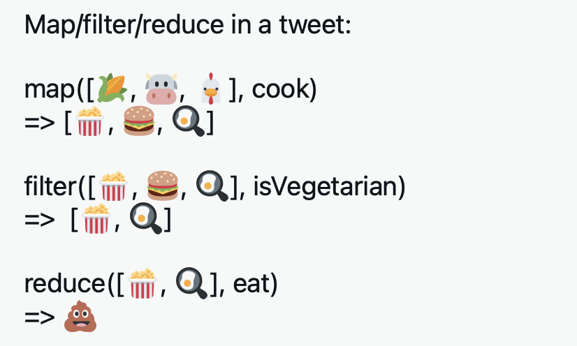

  

# JavaScript Map, Reduce, and Filter - JS Array Functions Explicadas con Ejemplos de Código

## Map

El método `map()` se utiliza para crear un nuevo array a partir de uno existente, aplicando una función a cada uno de los elementos del primer array.

### Syntax

```javascript
let new_array = arr.map(function callback(element, index, array) {
    // Return value for new_array
}[, thisArg])
```

En el callback, sólo se requiere el array `element`. Normalmente se realiza alguna acción sobre el valor y luego se devuelve un nuevo valor.

### Ejemplo 

En el siguiente ejemplo, cada número del array se duplica.

```javascript
const numbers = [1, 2, 3, 4];
const doubled = numbers.map(item => item * 2);
console.log(doubled); // [2, 4, 6, 8]
```

## Filter

El método `filter()` toma cada elemento de un array y aplica una sentencia condicional contra él. Si esta condicional devuelve true, el elemento es empujado al array de salida. Si la condición es falsa, el elemento no se envía a la matriz de salida. 

### Syntax

```javascript
let new_array = arr.filter(function callback(element, index, array) {
    // Return true or false
}[, thisArg])
```

La sintaxis de `filter` es similar a la de `map`, excepto que la función de callback de llamada debe devolver `true` para mantener el elemento, o `false` en caso contrario. En el callback, sólo se requiere  `element`. 

### Ejemplos

En el siguiente ejemplo, se "filtran" los números impares, dejando sólo los pares.

```javascript
const numbers = [1, 2, 3, 4];
const evens = numbers.filter(item => item % 2 === 0);
console.log(evens); // [2, 4]
```

En el siguiente ejemplo, se utiliza `filter()` para obtener todos los alumnos cuyas notas son mayores o iguales a 90.

```javascript
const students = [
  { name: 'Quincy', grade: 96 },
  { name: 'Jason', grade: 84 },
  { name: 'Alexis', grade: 100 },
  { name: 'Sam', grade: 65 },
  { name: 'Katie', grade: 90 }
];

const studentGrades = students.filter(student => student.grade >= 90);
return studentGrades; // [ { name: 'Quincy', grade: 96 }, { name: 'Alexis', grade: 100 }, { name: 'Katie', grade: 90 } ]
```

## Reduce

El método `reduce()` reduce un array de valores a un solo valor. Para obtener el valor de salida, ejecuta una función reductora en cada elemento del array.

### **Syntax**

```javascript
arr.reduce(callback[, initialValue])
```

El argumento `callback` es una función que será llamada una vez por cada elemento del array. Esta función toma cuatro argumentos, pero a menudo sólo se utilizan los dos primeros.

-  _accumulator_ - el valor devuelto de la iteración anterior
- _currentValue_ - el elemento actual de la matriz
- _index_ - el índice del elemento actual
- _array_ - el array original sobre el que se llamó a reducir
- El argumento `initialValue` es opcional. Si se proporciona, se utilizará como valor inicial del acumulador en la primera llamada a la función de devolución de llamada.

### Ejemplos

El siguiente ejemplo suma todos los números de una matriz de números.

```javascript
const numbers = [1, 2, 3, 4];
const sum = numbers.reduce(function (result, item) {
  return result + item;
}, 0);
console.log(sum); // 10
```

En el siguiente ejemplo, `reduce()` se utiliza para transformar un array de cadenas en un único objeto que muestra cuántas veces aparece cada cadena en el array. Observe que esta llamada a reduce pasa un objeto vacío `{}` como parámetro `initialValue`. Éste se utilizará como valor inicial del acumulador (el primer argumento) que se pasa a la función callback.

```javascript
let pets = ['dog', 'chicken', 'cat', 'dog', 'chicken', 'chicken', 'rabbit'];

let petCounts = pets.reduce(function(obj, pet){
    if (!obj[pet]) {
        obj[pet] = 1;
    } else {
        obj[pet]++;
    }
    return obj;
}, {});

console.log(petCounts); 

/*
Output:
 { 
    dog: 2, 
    chicken: 3, 
    cat: 1, 
    rabbit: 1 
 }
 */
```

En pocas palabras,

filter: Cuando se necesita eliminar algún elemento no deseado del array.
map: Convierte un array en otro.
reduce: Cuando se necesita reducir el array.


## Ejercicios

## [1] Array squared

Square the value of every element in the array. Presume that you will only get numbers in the input array.

Helpful links

-   [Array.prototype.map()](https://developer.mozilla.org/en-US/docs/Web/JavaScript/Reference/Global_Objects/Array/map)
-   [Math.pow()](https://developer.mozilla.org/en-US/docs/Web/JavaScript/Reference/Global_Objects/Math/pow)

Input

```javascript
  const input = [ 1, 2, 3, 4, 5 ];
```

Result

```javascript
  [ 1, 4, 9, 16, 25]
```

<details><summary>Respuesta - ¡Haz Click!</summary>

```javascript
 const input = [ 1, 2, 3, 4, 5 ];

  input.map(function(num) {
    return Math.pow(num, 2);
  });

  // or written with Arrow function 
  input.map(num => Math.pow(num, 2));
```

</details>


## [2] Sum of every positive element

If the given input is an array of numbers, return the sum of all the positives ones. If the array is empty or there aren't any positive numbers, return 0.

Helpful links

-   [Array.prototype.filter()](https://developer.mozilla.org/en-US/docs/Web/JavaScript/Reference/Global_Objects/Array/filter)
-   [Array.prototype.reduce()](https://developer.mozilla.org/en-US/docs/Web/JavaScript/Reference/Global_Objects/Array/Reduce)

Input

```javascript
  const input = [ 1, -4, 12, 0, -3, 29, -150];
```

Result

```javascript
  42
```

<details><summary>Respuesta - ¡Haz Click!</summary>

```javascript
const input = [ 1, -4, 12, 0, -3, 29, -150];

  input
  .filter(function(num) {
    return num > 0;
  })
  .reduce(function(accumulator, currentValue) {
    return accumulator + currentValue;
  }, 0);

  // or written with Arrow function 
  input.filter(num => num > 0)
  .reduce((accumulator, currentValue) => accumulator + currentValue, 0);
```

</details>


## [3] Calculate median and mean

Calculate the mean and median values of the number elements from the input array.

Helpful links

-   [Array.prototype.reduce()](https://developer.mozilla.org/en-US/docs/Web/JavaScript/Reference/Global_Objects/Array/Reduce)
-   [Array.prototype.sort()](https://developer.mozilla.org/en-US/docs/Web/JavaScript/Reference/Global_Objects/Array/sort)
-   [Math.abs()](https://developer.mozilla.org/en-US/docs/Web/JavaScript/Reference/Global_Objects/Math/abs)

Input

```javascript
  const input = [12, 46, 32, 64];
  
```

Result

```javascript
  { mean: 38.5, median: 32 }
```

<details><summary>Respuesta - ¡Haz Click!</summary>

```javascript

 const input = [12, 46, 32, 64];
  input.sort((a, b) => a - b);

  input
  .reduce((accumulator, currentValue, index, array) => {

    accumulator.mean += currentValue /  array.length;

    if(Math.abs(index + 1  - array.length / 2) gt 1) { 
      accumulator.median = currentValue 
    }

    return accumulator;
  }, { mean: 0, median: 0 });
  
```

</details>


## [4] Get name initials

The given input is a string of multiple words with a single space between each of them. Abbreviate the name and return the name initials.

Helpful links

-   [Array.prototype.map()](https://developer.mozilla.org/en-US/docs/Web/JavaScript/Reference/Global_Objects/Array/map)
-   [String.prototype.split()](https://developer.mozilla.org/en-US/docs/Web/JavaScript/Reference/Global_Objects/String/split)
-   [String.prototype.join()](https://developer.mozilla.org/en-US/docs/Web/JavaScript/Reference/Global_Objects/Array/join)

Input

```javascript
  const input = 'George Raymond Richard Martin';
```

Result

```javascript
  'GRRM'
```

<details><summary>Respuesta - ¡Haz Click!</summary>

```javascript
  const input = 'George Raymond Richard Martin';

  input
  .split(' ')
  .map(function(word) {
    return word[0];
  })
  .join('');

  // or written with Arrow function 
  input.split(' ').map(word => word[0]).join('');
```

</details>


## [5] Age difference from the youngest and oldest

Find the difference in age between the oldest and youngest family members, and return their respective ages and the age difference.

Helpful links

-   [Array.prototype.map()](https://developer.mozilla.org/en-US/docs/Web/JavaScript/Reference/Global_Objects/Array/map)
-   [Math.min()](https://developer.mozilla.org/en-US/docs/Web/JavaScript/Reference/Global_Objects/Math/min)
-   [Math.max()](https://developer.mozilla.org/en-US/docs/Web/JavaScript/Reference/Global_Objects/Math/max)

Input

```javascript
  const input = [
    {
      name: 'John',
      age: 13
    },
    {
      name: 'Mark',
      age: 56,
    },
    {
      name: 'Rachel',
      age: 45,
    },
    {
      name: 'Nate',
      age: 67,
    },
    {
      name: 'Jeniffer',
      age: 65,
    }
  ];
  
```

Result

```javascript
  [13, 67, 54]
```

<details><summary>Respuesta - ¡Haz Click!</summary>
```javascript
const input = [
    {
      name: 'John',
      age: 13
    },
    {
      name: 'Mark',
      age: 56,
    },
    {
      name: 'Rachel',
      age: 45,
    },
    {
      name: 'Nate',
      age: 67,
    },
    {
      name: 'Jeniffer',
      age: 65,
    }
  ];

  const ages = input.map(person => person.age);

  [Math.min(...ages), Math.max(...ages), Math.max(...ages) - Math.min(...ages)];
```
</details>


## [6] Numeronyms

Devs like to abbreviate everything: k8s means Kubernetes, a11y means accessibility, l10n means localization. You get the Dev numeronyms by taking the first and the last letter and counting the number of letters in between. Words that have less than 4 letters aren't abbreviated, because that would just be odd. The input is a sentence, and you should abbreviate every word that is 4 letters long or longer. There won't be any punctuation in the sentence. g2d l2k e6e

Helpful links

-   [Array.prototype.map()](https://developer.mozilla.org/en-US/docs/Web/JavaScript/Reference/Global_Objects/Array/map)
-   [String.prototype.split()](https://developer.mozilla.org/en-US/docs/Web/JavaScript/Reference/Global_Objects/String/split)
-   [String.prototype.join()](https://developer.mozilla.org/en-US/docs/Web/JavaScript/Reference/Global_Objects/Array/join)

Input

```javascript
  const input = 'Every developer likes to mix kubernetes and javascript';
```

Result

```javascript
  'E3y d7r l3s to mix k8s and j8t'
```

<details><summary>Respuesta - ¡Haz Click!</summary>

```javascript
const input = 'Every developer likes to mix kubernetes and javascript';

  const createNumeronym = (word) => word[0] + (word.length - 2) +  word[word.length - 1];

  input
  .split(' ')
  .map(function(word) {
    if(word.length >= 4) {
      return createNumeronym(word);
    }
    return word;
  })
  .join(' ');


  // or written with Arrow function and Conditional operator
  input
  .split(' ')
  .map(word => word.length >= 4 ? createNumeronym(word) : word)
  .join(' ');
```

</details>


## [7] n! with Map and Reduce 

If the given input is a number, you should return the factorial of that number. The factorial of a natural number n is the product of the positive integers less than or equal to n. So, 2! = 2, 3! = 6, 4! = 24 and so on.

Helpful links

-   [Array.prototype.map()](https://developer.mozilla.org/en-US/docs/Web/JavaScript/Reference/Global_Objects/Array/map)
-   [Array.prototype.fill()](https://developer.mozilla.org/en-US/docs/Web/JavaScript/Reference/Global_Objects/Array/fill)
-   [Array.prototype.reduce()](https://developer.mozilla.org/en-US/docs/Web/JavaScript/Reference/Global_Objects/Array/Reduce)

Input

```javascript
  const input = 6;
```

Result

```javascript
  720
```

<details><summary>Respuesta - ¡Haz Click!</summary>

```javascript
  const input = 6;

  const array = new Array(input).fill(null);
  // array is [null, null, null, null, null, null]

  array
  .map(function(currentValue, index) {
    return index + 1;
  })
  .reduce(function(accumulator, currentValue) {
    return accumulator * currentValue;
  });


  // or written with Arrow function
  new Array(input)
  .fill(null)
  .map((currentValue, index) => index + 1)
  .reduce((accumulator, currentValue) => accumulator * currentValue);
```
</details>


## [8] Count elements in array of arrays

Count the occurrences of distinct elements in the given 2D array. The given input is an array, the elements of which are arrays of strings. The result is an object whose property names are the values from the arrays and their value is the number of their occurrences. 

Helpful links

-   [Array.prototype.reduce()](https://developer.mozilla.org/en-US/docs/Web/JavaScript/Reference/Global_Objects/Array/Reduce)
-   [Array.prototype.flat()](https://developer.mozilla.org/en-US/docs/Web/JavaScript/Reference/Global_Objects/Array/flat)

Input

```javascript
  const input = [
    ['a', 'b', 'c'],
    ['c', 'd', 'f'],
    ['d', 'f', 'g'],
  ];
```

Result

```javascript
  {
    a: 1,
    b: 1,
    c: 2,
    d: 2,
    f: 2,
    g: 1,
  }
```

<details><summary>Respuesta - ¡Haz Click!</summary>

```javascript
const input = [
    ['a', 'b', 'c'],
    ['c', 'd', 'f'],
    ['d', 'f', 'g'],
  ];

  input
  .flat()
  .reduce((accumulator, currentValue) => {
    if(accumulator[currentValue]) {
      accumulator[currentValue] += 1;
    } else {
      accumulator[currentValue] = 1;
    }
    return accumulator;
  }, {});
```
</details>


